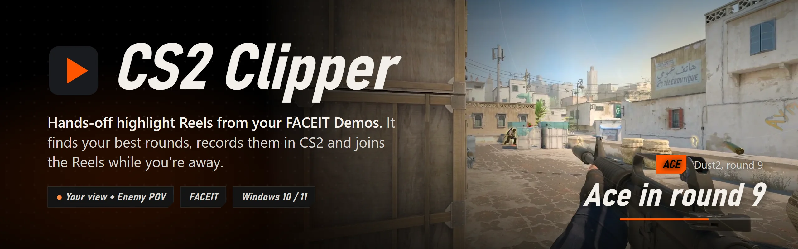
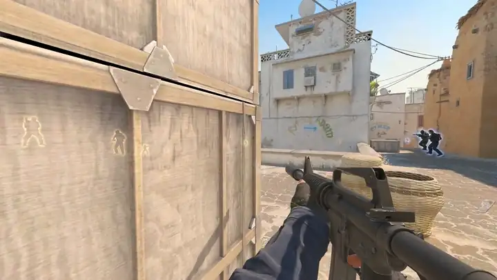
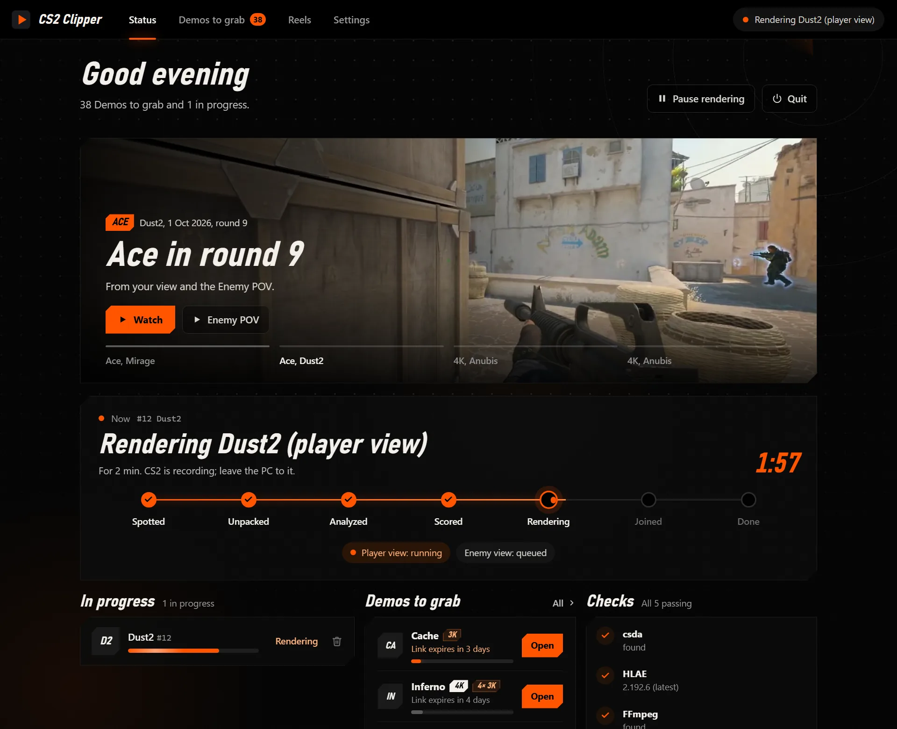
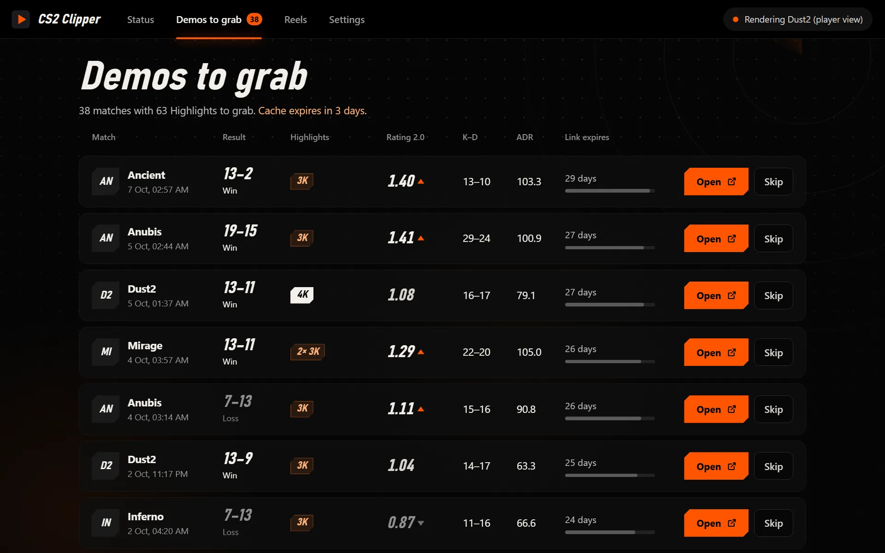
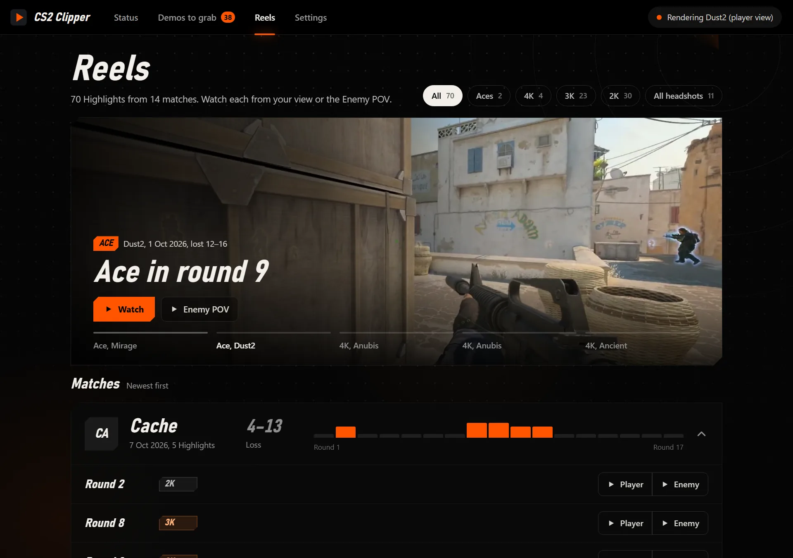
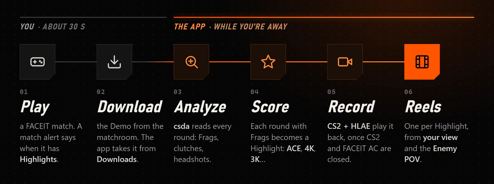

<p align="center">
  
</p>

<p align="center">
  <a href="https://github.com/MohammadAM02/cs2-clipper/releases/latest"></a>
  
  
  
</p>

<h3 align="center">Play FACEIT. Download the Demo. Come back to your Highlights.</h3>

<p align="center">
  CS2 Clipper finds the rounds worth watching in your FACEIT Demos, records each one in CS2<br>
  from your view <i>and</i> the enemy's, and joins them into Reels. No editor, no timeline, no clicks in between.
</p>

<p align="center">
  <a href="https://github.com/MohammadAM02/cs2-clipper/releases/latest/download/CS2Clipper-Setup.exe"><b>Download for Windows</b></a>
  &nbsp;·&nbsp; <a href="#how-it-works">How it works</a>
  &nbsp;·&nbsp; <a href="#install">Install</a>
  &nbsp;·&nbsp; <a href="#build-from-source">Build from source</a>
</p>

<p align="center">
  
  <br>
  <sub>Round 9 on Dust2, the start of an Ace. The app found it, recorded it and joined the Reel on its own.</sub>
</p>

## What it does

- **Finds your rounds.** Every round with your Frags becomes a Highlight with a Score: an Ace, a 4K, a 3K,
  with bonuses for all-headshot rounds and knife, no-scope, through-smoke and blind Frags. The best five of
  each match get recorded.
- **Records them in the game.** CS2 plays the Demo back through HLAE, and each Frag is recorded at 60 fps
  with its build-up: 4 seconds before, 2 after.
- **Shows both sides.** Every Highlight comes twice: from your view, and from an Enemy POV that follows
  each player you take down.
- **Stays out of your way.** It records only while CS2 and FACEIT AC are closed, gives a 30-second
  heads-up first, and stops the moment FACEIT AC starts.
- **Tells you what to grab.** Match alerts flag the FACEIT matches that have Highlights, and Demos to grab
  counts down to the day FACEIT's link expires. That page opens on your phone too.
- **Plays them back.** The Reels page holds every Highlight, filtered by Aces, 4Ks, 3Ks or all-headshot
  rounds, one click from either view.

## A look inside

<p align="center">
  
  <br>
  <sub><b>Status</b>: what the app is doing right now, the latest Highlights, and whether this PC is ready.</sub>
</p>

<table>
  <tr>
    <td width="50%"></td>
    <td width="50%"></td>
  </tr>
  <tr>
    <td align="center"><sub><b>Demos to grab</b>: matches worth downloading, with Rating 2.0, K-D and ADR.</sub></td>
    <td align="center"><sub><b>Reels</b>: every Highlight, from your view or the Enemy POV.</sub></td>
  </tr>
</table>

## How it works

<p align="center">
  
</p>

Each Demo moves through the same steps, the ones on the Status page. Every step can run again, so a crash or
a reboot picks up where it stopped.

| Step | What happens |
| --- | --- |
| **Spotted** | A finished FACEIT Demo lands in Downloads and moves into your clips folder. |
| **Unpacked** | The `.dem.zst` FACEIT serves becomes a `.dem`. |
| **Analyzed** | [csda](https://github.com/akiver/cs-demo-analyzer) reads every round; the app keeps what it needs as `analyses\<checksum>.json`. |
| **Scored** | Each round with your Frags becomes a Highlight; the five with the best Score are picked. |
| **Rendering** | HLAE starts CS2 and a console script ([`hlae_plan.py`](clipper/hlae_plan.py)) records each Sequence at its exact ticks: your view first, then the Enemy POV. |
| **Joined** | FFmpeg joins each Highlight's Clips into one Reel per view. |
| **Done** | The unpacked `.dem` is deleted, and a notification says the Reels are ready. |

### Safe around FACEIT AC

Nothing starts CS2 unless the **Gate** is clear: no CS2 running, FACEIT AC off (neither its service nor its
client), and at least 5 GB free on the clips drive. While it records, the app keeps checking; if FACEIT AC
starts, it closes the game it launched straight away and redoes that render later. CS2 only ever starts for
offline Demo playback, and the app never touches a CS2 you started yourself.

## Install

1. **Download** [`CS2Clipper-Setup.exe`](https://github.com/MohammadAM02/cs2-clipper/releases/latest/download/CS2Clipper-Setup.exe)
   from the [latest release](https://github.com/MohammadAM02/cs2-clipper/releases/latest) and run it. It
   installs for your Windows account only, with no admin prompt, and starts in the tray when you sign in
   (untick that in the installer if you'd rather it didn't).
2. **Set up this PC** from the Status page. The app downloads what it records with, csda, FFmpeg and HLAE,
   into `%LOCALAPPDATA%\CS2Clipper\tools`.
3. **Say who you are** in Settings → You: your FACEIT nickname (**Look up** fills in your SteamID). Then
   choose a clips folder.

> **Needs** Windows 10 or 11, CS2 installed through Steam (with Steam running while it records), a FACEIT
> account and 5 GB free on the clips drive.

## Using it

1. **Play a FACEIT match.** When it has Highlights, a match alert says so, and the match shows up in
   Demos to grab.
2. **Download the Demo** with **Open**, which takes you to the matchroom. That is the one manual step:
   FACEIT keeps Demo downloads behind a partner-only API ([ADR 0001](docs/adr/0001-faceit-only-ingestion.md)).
3. **Walk away.** Status shows each step, and the tray icon says what the app is doing.
4. **Watch** on the Reels page, or open the files in
   `<clips folder>\library\videos\<match>\r<round>-player.mp4` and `…-enemy.mp4`.

> [!TIP]
> A CS2 update can break HLAE until advancedfx ships a fix. Status checks for new HLAE releases every day
> and says when one is out.

## Build from source

You need [uv](https://docs.astral.sh/uv/); it fetches Python 3.13 itself.

```powershell
git clone https://github.com/MohammadAM02/cs2-clipper
cd cs2-clipper
uv sync
uv run clipper     # the app: tray, window and pages
uv run pytest      # over 1,000 tests; none needs CS2, HLAE or FACEIT
```

Run from source, the app needs your own FACEIT Data API key in Settings → You; installed builds ship one.
Set `CLIPPER_DATA_DIR` to keep a development copy's data apart from the installed app's.

| Command | What it does |
| --- | --- |
| `clipper` | the app (`--open reels` opens a page; `--background` starts in the tray) |
| `clipper setup` | installs what this PC lacks: csda, FFmpeg and HLAE |
| `clipper status` | every Demo's state, and the Gate |
| `clipper retry <demo>` | sends a failed Demo back through |
| `clipper resume` | resumes rendering after a pause |
| `clipper highlights <demo>` | prints the scored Highlights of an analyzed Demo |
| `clipper quit` | asks the running copy to quit, and waits until it has |

`packaging\build.ps1 -Installer` builds `dist\CS2Clipper.exe` (PyInstaller, one file) and
`dist\CS2Clipper-Setup.exe` (Inno Setup). Pushing a `v*` tag runs the
[release workflow](.github/workflows/release.yml): the tests, the build, a proof install on a clean runner,
then a GitHub Release with the installer.

## Project layout

```text
clipper/              the app
├── pages/            Status, Demos to grab, Reels and Settings: plain HTML, CSS and JS
├── worker.py         moves each Demo through the steps
├── intake.py         takes finished Demos from Downloads
├── analysis.py       the only code that reads csda's output
├── scoring.py        a round's facts become a Highlight and its Score
├── gate.py           may CS2 launch right now?
├── hlae_plan.py      Sequences become the console script CS2 follows
├── hlae_render.py    one Render Job: CS2 through HLAE, watched to the end
├── join.py           Clips become one Reel per view
├── alerts.py         match alerts from the FACEIT Data API
├── app.py            tray, window, web server and worker, together
└── …
tests/                pytest; a whole Render Job runs against a scripted world
packaging/            the PyInstaller spec, the Inno Setup script, build and proof scripts
scripts/              faceit_probe.py, a one-shot check of what a FACEIT key can read
docs/
├── adr/              architecture decisions
├── agents/           how coding agents work in this repo
├── images/           the pictures in this README
└── index.html        GitHub Pages: hands a FACEIT sign-in back to the app
.scratch/             design specs and open issues
CONTEXT.md            the words this project uses: Demo, Highlight, Frag, Reel, Enemy POV…
```

## Credits

CS2 Clipper is built on open-source work:

- [HLAE](https://github.com/advancedfx/advancedfx) by advancedfx (MIT) drives CS2 and records it.
- [cs-demo-analyzer](https://github.com/akiver/cs-demo-analyzer) by akiver (MIT) reads every Demo.
- [CS Demo Manager](https://github.com/akiver/cs-demo-manager) by akiver (MIT): its Sequence builders and the
  commands its video export sends are ported in [`hlae_plan.py`](clipper/hlae_plan.py).
- [Aegis](https://github.com/thelifeofsuleyman/cs2-clipper) by thelifeofsuleyman (MIT): the app shell, tray,
  window and installer started from it.
- [faceitperf](https://github.com/iffypixy/faceitperf) by iffypixy (MIT): the Rating 2.0 estimate.
- [FFmpeg](https://ffmpeg.org), in [gyan.dev's builds](https://www.gyan.dev/ffmpeg/builds/), joins the Clips.

<sub>Not affiliated with Valve or FACEIT. Counter-Strike 2 is a trademark of Valve Corporation.</sub>
